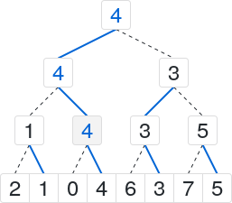
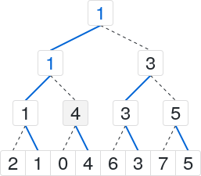

Lowbits
=======
An out-of-place sorting algorithm.

When is this useful?
--------------------
Starting with an unordered array, Lowbits outputs the elements of that array in order, one at a time. The original array is not
modified, though it must remain available in memory during the sort process. This requires O(n log n) comparisons and O(n) space
complexity.

The bookkeeping here is fairly expensive: [libstdc++](https://gcc.gnu.org/onlinedocs/libstdc++/) std::sort() for plain integers
can run 10-15 times faster. To get a sorted array from this algorithm, it can be much cheaper to copy the source array into the
destination array, and sort that. To get the first N elements of the sorted destination sequence, it's probably faster to feed
the elements of the source array to a priority queue with a maximum size of N+1 elements.

This repository contains a (mildly suboptimal) C++ implementation of the algorithm. See [`example.cpp`](example.cpp).

How does it work?
-----------------
Lowbits is based around a dense binary tree which is scanned and modified repeatedly to obtain successive output values. The
leaves are the elements of the input array, in their original order. Each internal node has a two-bit representation: bit 0
determines which child should be visited first to get the next output value. Bit 1 determines whether bit 0 has been flipped
yet. Internal nodes are never rearranged, and unlike typical binary search trees, nodes don't contain pointers to child nodes,
nor do they contain values from the source array. This allows them to be stored as a series of bit arrays in memory.

The tree has implicit values for each node, determined by following child nodes indicated by bit 0 to a leaf node.

Starting with the array `{2, 1, 0, 4, 6, 3, 7, 5}`:

Initially this tree is built so that each internal node has bit 0 pointing to the lesser of its two child nodes, as indicated by
the solid blue lines. Bit 1 is clear for all nodes.

Following the blue lines from the root node gets us our first result.

We don't want to get the 0 again, so flip bit 0 for its parent node, and mark bit 1 because we flipped bit 0. The node values
change because of this, and this needs to be fixed.

To fix this, we go to parent nodes, and like we did at the beginning, figure out which child node is the lesser node. We keep
doing this with successive parent nodes. In this example, the parent of the grey (0->4) node was flipped (4->1). That node's
parent, the root node, also changed its value, but it didn't need to be flipped.

Once again, we follow the nodes via bit 0 to get our next element, a 1.

And we flip our bit 0 for the 1's parent node. In this instance, no other nodes need to be flipped. After this is a 2.

In this case, we've already flipped bit 0 for the 2's immediate parent node, so we head up through parent nodes until we get to
one that hasn't been flipped yet. Then we flip that one.

And, once again, fix the parent nodes like we did before.

Repeat this process until you have a satisfactory amount of sorted values.

Disclaimer
----------

I am not familiar with every sorting algorithm that exists. It is possible that somebody else came up with this under a
different name at some point in the past.

License
-------

Lowbits is copyright (C) 2017 Dave Odell <<dmo2118@gmail.com>>

This program is free software: you can redistribute it and/or modify it under the terms of the GNU General Public License as
published by the Free Software Foundation, version 3.

This program is distributed in the hope that it will be useful, but WITHOUT ANY WARRANTY; without even the implied warranty of
MERCHANTABILITY or FITNESS FOR A PARTICULAR PURPOSE.  See the GNU General Public License for more details.

You should have received a copy of the GNU General Public License along with this program.  If not, see
<https://www.gnu.org/licenses/>.
